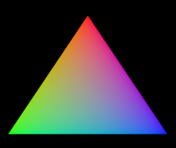

<div align="center">

## 🦀 Rust Graphics
Using rust to create a graphical shader rendering pipeline



</div>

## 📬 Goal and purposes

The goal with this project was for me to get some hands on experience interfacing with the GPU through the Rust programming language. It uses rust wgsl and opengl libraries to interface with the GPU. The application sets up a window and renders a triangle with some RGB mixed colors. This project is part of my endeavours in learning the Rust programming language. 

## 🛠 Content

**shader.wgsl** : 

WGSL shader that defines a simple triangle rendering process. It takes vertex indices as input and assigns positions and colors to each vertex of a triangle.

**renderpipeline.rs** : 
	
*Sets up our graphical application using winit and wgpu libraries. It takes a window and configures a Vulkan based graphics instance and establishes a rendering pipeline with our shader.*

**main.rs** : 

Application entry point that hosts the event loop. 

## 🚀 Usage

Asumes you have rust and cargo installed and configured

```bash
cargo run 
```

